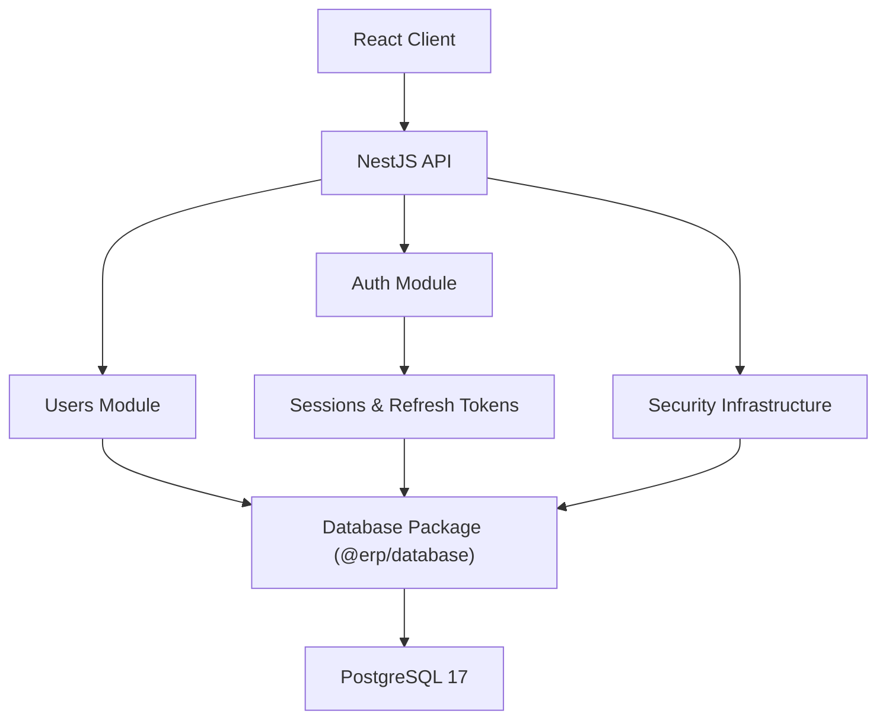

# ERP System

[](https://github.com/fgorordodev/erp-system/actions/workflows/ci.yml)
[](docs/ROADMAP.md)
[](LICENSE)
[](package.json)
[](package.json)
[](package.json)
[](apps/backend/package.json)
[](apps/frontend/package.json)
[](apps/frontend/package.json)
[](docker-compose.yml)
[](packages/database/package.json)
[](docker-compose.yml)
[](turbo.json)

A modular, type-safe ERP platform built as a professional full-stack monorepo. The current milestone delivers a production-oriented backend foundation with authentication, persistent sessions, refresh-token rotation, RBAC, user administration, PostgreSQL persistence, API documentation and automated quality checks.

> **Project state:** backend foundation and identity/security capabilities are implemented. The frontend shell exists, while business modules such as inventory, sales and purchasing remain on the roadmap.

## Highlights

- NestJS REST API with modular domain boundaries.
- Access tokens backed by persistent, revocable sessions.
- Hashed refresh tokens with one-time rotation and reuse protection.
- Multi-role RBAC with explicit permissions and deny-by-default guards.
- User CRUD, status management and soft deletion.
- Prisma package isolated behind `@erp/database`.
- PostgreSQL 17 through Docker Compose.
- Swagger/OpenAPI, health checks and a Postman collection.
- Turborepo orchestration for build, lint, tests and type checking.
- GitHub Actions CI for clean-install verification.

## Architecture



The backend distinguishes authentication workflows from reusable security infrastructure:

- `modules/auth`: login, refresh, logout, credentials, sessions and token rotation.
- `security`: JWT utilities, guards, decorators, hashing, encryption and RBAC constants.
- `modules/users`: user administration, projections, mapping and soft-delete behavior.
- `packages/database`: Prisma schema, migrations, seed, generated client and database exports.

See [Architecture](docs/ARCHITECTURE.md), [Security](docs/SECURITY.md), [Database](docs/DATABASE.md) and the [ADR index](docs/adr/README.md).

## Repository structure

```text
erp-system/
├── apps/
│   ├── backend/              # NestJS REST API
│   └── frontend/             # React + Vite application shell
├── packages/
│   ├── database/             # Prisma schema, client, migrations and seed
│   └── tsconfig/             # Shared TypeScript configurations
├── docs/
│   └── adr/                  # Architecture Decision Records
├── postman/                  # Collection and local environment
├── .github/workflows/ci.yml
├── docker-compose.yml
├── turbo.json
└── pnpm-workspace.yaml
```

## Requirements

- Node.js `>=20.19.0` (CI uses Node.js 22)
- pnpm `>=10.0.0` (repository pins `10.15.1`)
- Docker with Docker Compose

## Getting started

```bash
git clone git@github.com:fgorordodev/erp-system.git
cd erp-system
pnpm install
cp .env.example .env
```

Replace every example secret in `.env` before starting the API:

```bash
openssl rand -hex 64 # JWT access secret
openssl rand -hex 64 # JWT refresh secret
openssl rand -hex 32 # AES-256-GCM key
```

Start PostgreSQL, generate Prisma Client, apply migrations and seed the development administrator:

```bash
docker compose up -d
pnpm db:generate
pnpm db:migrate
pnpm db:seed
```

Start the workspace:

```bash
pnpm dev
```

| Service     | URL                                |
| ----------- | ---------------------------------- |
| Backend API | `http://localhost:3000/api`        |
| Swagger UI  | `http://localhost:3000/docs`       |
| Frontend    | `http://localhost:5173`            |
| Health      | `http://localhost:3000/api/health` |

## Available commands

| Command             | Purpose                                                   |
| ------------------- | --------------------------------------------------------- |
| `pnpm dev`          | Run development tasks across the workspace                |
| `pnpm dev:backend`  | Run only the NestJS API                                   |
| `pnpm dev:frontend` | Run only the React application                            |
| `pnpm build`        | Build packages and applications in dependency order       |
| `pnpm lint`         | Run configured ESLint tasks                               |
| `pnpm typecheck`    | Run TypeScript validation                                 |
| `pnpm test`         | Run available test suites                                 |
| `pnpm format`       | Format supported files with Prettier                      |
| `pnpm format:check` | Validate formatting without modifying files               |
| `pnpm db:generate`  | Generate Prisma Client                                    |
| `pnpm db:migrate`   | Create/apply a development migration                      |
| `pnpm db:deploy`    | Apply committed migrations in deployment environments     |
| `pnpm db:seed`      | Seed roles, permissions and the development administrator |
| `pnpm db:studio`    | Open Prisma Studio                                        |

## API surface

Current public endpoints:

- `GET /api/health`
- `POST /api/auth/login`
- `POST /api/auth/refresh`

Authenticated endpoints include:

- `POST /api/auth/logout`
- `GET /api/users/me`
- permission-protected user administration routes

See [API documentation](docs/API.md) or import `postman/ERP-System.postman_collection.json`.

## CI pipeline

GitHub Actions executes a clean workspace flow:

1. install dependencies;
2. generate and build `@erp/database`;
3. lint;
4. type-check;
5. build;
6. test.

The database package is built before typed ESLint runs so `@erp/database` declarations and generated Prisma types exist in a clean runner.

## Roadmap

Completed foundation work includes the monorepo, backend bootstrap, database package, authentication, persistent sessions, refresh-token rotation, RBAC, user management, documentation and CI foundation.

Next priorities are meaningful automated tests, rate limiting, audit logging, organization/tenant boundaries, frontend authentication and the first ERP business modules. Track the detailed sequence in [ROADMAP.md](docs/ROADMAP.md).

## Contributing

Read [CONTRIBUTING.md](CONTRIBUTING.md). The project uses focused branches and Conventional Commit-style messages:

```text
feat(auth): add session rotation
fix(ci): build database package before lint
docs: align architecture documentation
```

## License

Distributed under the [MIT License](LICENSE). Copyright © 2026 Fernando Gorordo.
