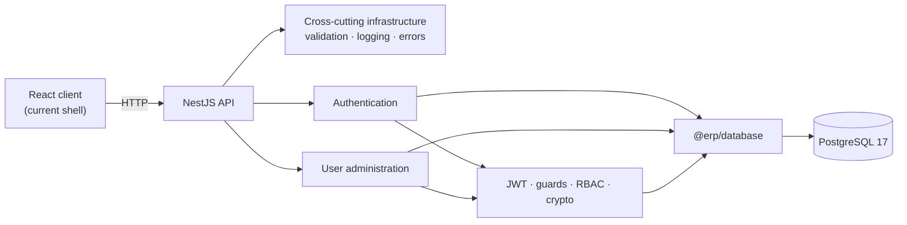

# ERP System

[](https://github.com/fgorordodev/erp-system/actions/workflows/ci.yml)
[](docs/ROADMAP.md)
[](LICENSE)
[](package.json)
[](package.json)
[](package.json)
[](apps/backend/package.json)
[](apps/frontend/package.json)
[](docker-compose.yml)
[](packages/database/package.json)

A modular, type-safe ERP platform developed as a professional full-stack monorepo. The current implementation provides the technical foundation for authentication, persistent sessions, refresh-token rotation, role-based access control, user administration, PostgreSQL persistence, API documentation and automated quality checks.

> **Current state:** the backend identity and security foundation is implemented. The frontend is an initial React/Vite shell. Inventory, sales, purchasing, accounting and other ERP domains are planned but not yet implemented.

## Contents

- [Highlights](#highlights)
- [Architecture](#architecture)
- [Repository structure](#repository-structure)
- [Requirements](#requirements)
- [Getting started](#getting-started)
- [Available commands](#available-commands)
- [API surface](#api-surface)
- [Documentation](#documentation)
- [Project status](#project-status)
- [Contributing](#contributing)

## Highlights

- NestJS 11 REST API with feature-oriented modules.
- JWT access tokens tied to persistent, revocable sessions.
- Hashed, one-time refresh tokens with rotation and reuse detection.
- Multi-role RBAC with explicit permissions.
- User creation, listing, profile retrieval, update, status control and soft deletion.
- Prisma 7 package isolated behind `@erp/database`.
- PostgreSQL 17 through Docker Compose.
- Swagger/OpenAPI and a Postman collection.
- Global validation, CORS, Helmet, request identifiers, logging and normalized API responses.
- Turborepo orchestration and GitHub Actions quality checks.

## Architecture


```mermaid
flowchart LR
    Client["React client\n(current shell)"]
    API["NestJS API"]
    Cross["Cross-cutting infrastructure\nvalidation · logging · errors"]
    Auth["Authentication"]
    Users["User administration"]
    Security["JWT · guards · RBAC · crypto"]
    DBPkg["@erp/database"]
    DB[("PostgreSQL 17")]

    Client -->|HTTP| API
    API --> Cross
    API --> Auth
    API --> Users
    Auth --> Security
    Users --> Security
    Auth --> DBPkg
    Users --> DBPkg
    Security --> DBPkg
    DBPkg --> DB
```

The API separates workflow-specific authentication code from reusable security infrastructure. See [Architecture](docs/ARCHITECTURE.md), [Security](docs/SECURITY.md) and [Database](docs/DATABASE.md).

## Repository structure

```text
erp-system/
├── apps/
│   ├── backend/              # NestJS REST API
│   └── frontend/             # React + Vite application shell
├── packages/
│   ├── api-contracts/        # Shared error codes/contracts
│   ├── database/             # Prisma schema, migrations, client and seed
│   ├── rbac/                 # Role and permission definitions
│   └── tsconfig/             # Shared TypeScript configuration
├── postman/                  # API collection and local environment
├── docs/                     # Project documentation
├── .github/workflows/ci.yml
├── docker-compose.yml
├── turbo.json
└── pnpm-workspace.yaml
```

## Requirements

- Node.js `>=20.19.0`
- pnpm `>=10.0.0` — repository package manager: `10.15.1`
- Docker and Docker Compose
- Git

## Getting started

```bash
git clone git@github.com:fgorordodev/erp-system.git
cd erp-system
pnpm install
cp .env.example .env
```

Generate secure secrets and replace the placeholder values in `.env`:

```bash
openssl rand -hex 64 # JWT_ACCESS_SECRET
openssl rand -hex 64 # JWT_REFRESH_SECRET
openssl rand -hex 32 # ENCRYPTION_KEY
```

Start PostgreSQL, apply migrations and seed the development administrator:

```bash
docker compose up -d
pnpm db:migrate
pnpm db:seed
pnpm db:build
```

Run the workspace:

```bash
pnpm dev
```

| Service | URL |
|---|---|
| API | `http://localhost:3000/api` |
| Swagger UI | `http://localhost:3000/docs` |
| OpenAPI JSON | `http://localhost:3000/docs-json` |
| Frontend | `http://localhost:5173` |
| Health | `http://localhost:3000/api/health` |

## Available commands

| Command | Purpose |
|---|---|
| `pnpm dev` | Run workspace development tasks |
| `pnpm dev:backend` | Run only the NestJS API |
| `pnpm dev:frontend` | Run only the React app |
| `pnpm build` | Build packages and applications |
| `pnpm lint` | Run configured ESLint tasks |
| `pnpm typecheck` | Run TypeScript validation |
| `pnpm test` | Run available test suites |
| `pnpm clean` | Clean workspace outputs and root dependencies |
| `pnpm db:generate` | Generate Prisma Client |
| `pnpm db:build` | Generate and build `@erp/database` |
| `pnpm db:migrate` | Create/apply a development migration |
| `pnpm db:deploy` | Apply committed migrations |
| `pnpm db:seed` | Seed permissions, roles and administrator |
| `pnpm db:studio` | Open Prisma Studio |

## API surface

Public routes:

- `GET /api/health`
- `POST /api/auth/login`
- `POST /api/auth/refresh`

Authenticated routes:

- `POST /api/auth/logout`
- `GET /api/users/me`

Permission-protected user administration:

- `POST /api/users`
- `GET /api/users`
- `GET /api/users/:id`
- `PATCH /api/users/:id`
- `PATCH /api/users/:id/status`
- `DELETE /api/users/:id`

See [API Reference](docs/API.md) or import `postman/ERP-System.postman_collection.json`.

## Documentation

| Document | Description |
|---|---|
| [Documentation index](docs/README.md) | Navigation hub |
| [Architecture](docs/ARCHITECTURE.md) | System boundaries and request lifecycle |
| [Backend](docs/BACKEND.md) | NestJS modules and conventions |
| [Frontend](docs/FRONTEND.md) | Current frontend state and intended boundaries |
| [Security](docs/SECURITY.md) | Authentication, sessions, tokens and RBAC |
| [Database](docs/DATABASE.md) | Prisma schema, migrations and seed |
| [API](docs/API.md) | Endpoints, envelopes and errors |
| [Packages](docs/PACKAGES.md) | Shared workspace packages |
| [Development](docs/DEVELOPMENT.md) | Local setup and workflow |
| [Testing](docs/TESTING.md) | Current coverage and test strategy |
| [CI/CD](docs/CI_CD.md) | Existing CI and deployment guidance |
| [Operations](docs/OPERATIONS.md) | Environment, health and production concerns |
| [Roadmap](docs/ROADMAP.md) | Implemented and planned work |
| [ADRs](docs/adr/README.md) | Architecture decisions |

## Project status

### Implemented

- Monorepo foundation
- Backend bootstrap and configuration validation
- PostgreSQL/Prisma persistence
- User, role, permission, session and refresh-token models
- Authentication and logout
- Refresh-token rotation with reuse detection
- Multi-role RBAC
- User administration and soft deletion
- Health endpoint
- Swagger/OpenAPI generation and validation scripts
- CI quality workflow

### Not implemented yet

- Production-ready frontend workflows
- Pagination and filtering for user lists
- Password-change endpoint
- Role-assignment administration endpoints
- Rate limiting
- Audit log
- Multi-factor authentication
- Multi-tenancy
- ERP business modules
- Deployment workflow
- Broad automated test coverage

## Contributing

Read [CONTRIBUTING.md](CONTRIBUTING.md) and the [Development Guide](docs/DEVELOPMENT.md). Use focused branches and Conventional Commit-style messages.

## License

Distributed under the [MIT License](LICENSE). Copyright © 2026 Fernando Gorordo.
