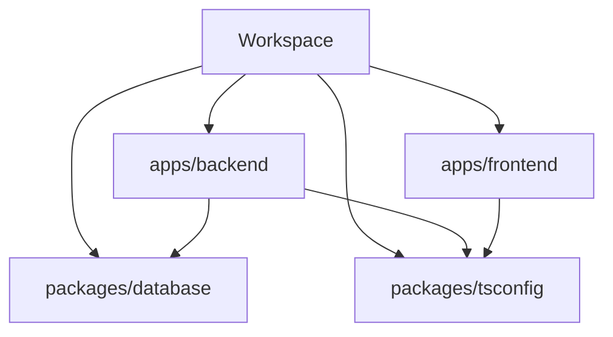
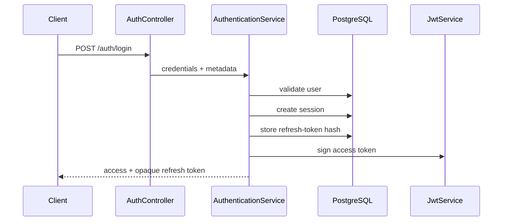

# Architecture

## Overview

ERP System is a pnpm/Turborepo monorepo. Applications own delivery concerns, while internal packages own reusable build-time or persistence capabilities.

## Workspace boundaries

### `apps/backend`

NestJS API organized around domain capabilities and cross-cutting infrastructure.

- `common`: filters, interceptors, middleware, exceptions and response contracts.
- `config`: environment and Swagger configuration.
- `database`: Nest provider integrating `@erp/database`.
- `modules`: application capabilities such as auth, users and health.
- `security`: reusable JWT, token, crypto, guard, decorator and RBAC infrastructure.

### `apps/frontend`

React 19 + Vite 6 application shell. It is intentionally minimal while backend contracts and security foundations stabilize.

### `packages/database`

Single persistence source of truth: Prisma schema, migrations, seed, generated client and package exports. Consumers import from `@erp/database` rather than generated paths.

### `packages/tsconfig`

Shared TypeScript bases for Node/Nest and React projects.

## Authentication and security separation

Authentication is a business workflow; security contains reusable enforcement mechanisms.

- `modules/auth` owns login, refresh, logout, credentials, sessions and token rotation.
- `security` owns guards, decorators, JWT signing/verification, token primitives, hashing, encryption and RBAC definitions.

## Protected request flow

1. The global JWT guard skips only routes marked `@Public()`.
2. Passport verifies the access-token signature and expiration.
3. `JwtStrategy` loads the user and session from persistence.
4. Revoked/expired sessions and inactive/deleted users are rejected.
5. Roles and permissions are resolved from current database state.
6. Role and permission guards evaluate route metadata.
7. Controllers receive an `AuthenticatedUser` rather than a raw Prisma entity.

This makes the persisted session the revocation source of truth; a structurally valid JWT alone does not guarantee access.

## Persistence contracts

Each domain uses narrow inputs, selects/projections and mappers:

This limits accidental exposure of sensitive fields and reduces coupling to generated Prisma object shapes.

## Build graph

`@erp/backend` imports `@erp/database`, whose public declarations live in `dist`. Clean CI runners therefore must generate Prisma Client and build the database package before type-aware lint or type checking analyzes the backend.

Turborepo expresses this dependency using `^build` for build-dependent quality tasks. The CI workflow also builds `@erp/database` explicitly to make the clean-environment prerequisite visible.

## Architectural principles

- High cohesion within capabilities and low coupling across modules.
- Stable package exports rather than deep internal imports.
- Dependency injection for runtime infrastructure.
- Explicit DTO and persistence boundaries.
- Deny-by-default authorization.
- Forward-only database migrations.
- Pragmatic layering; abstractions must solve demonstrated complexity.

## Current limitations

- Organization/tenant ownership has not been designed.
- Automated tests do not yet provide production confidence.
- The frontend does not yet implement authentication or ERP workflows.
- Observability, deployment and business-domain architecture remain future milestones.
