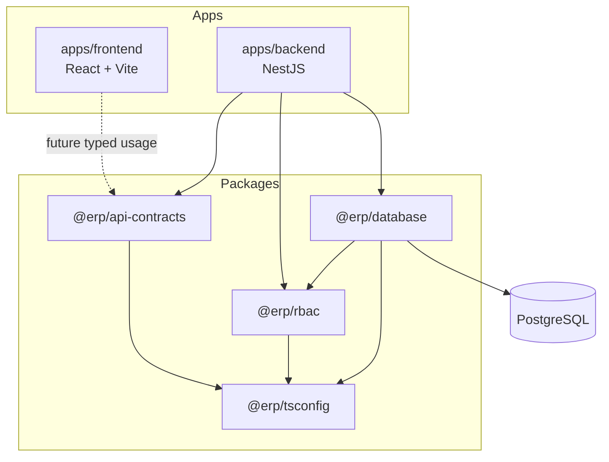
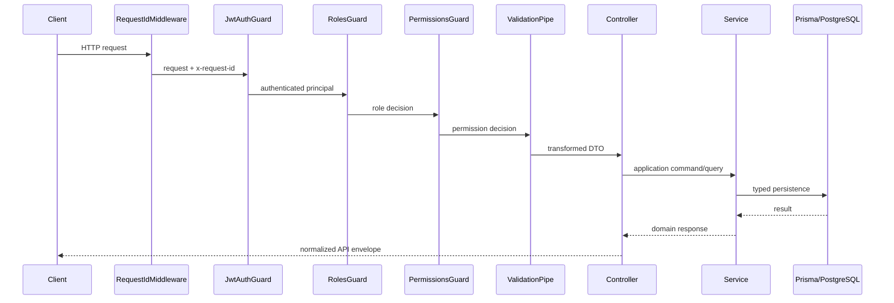

# Architecture

[← Documentation index](README.md) · [Backend →](BACKEND.md)

## Overview

ERP System is a pnpm/Turborepo monorepo containing two applications and four shared packages. The implemented milestone is an identity and security foundation for future ERP modules.

```mermaid
flowchart TB
    subgraph Apps
      FE["apps/frontend\nReact + Vite"]
      BE["apps/backend\nNestJS"]
    end

    subgraph Packages
      Contracts["@erp/api-contracts"]
      RBAC["@erp/rbac"]
      Database["@erp/database"]
      TS["@erp/tsconfig"]
    end

    PG[("PostgreSQL")]

    FE -. future typed usage .-> Contracts
    BE --> Contracts
    BE --> RBAC
    BE --> Database
    RBAC --> TS
    Contracts --> TS
    Database --> RBAC
    Database --> TS
    Database --> PG
```

## Architectural boundaries

### Applications

`apps/backend` owns HTTP transport, application workflows, security integration and process bootstrap.

`apps/frontend` is currently an independent React/Vite shell. It does not yet implement authentication or ERP screens.

### Packages

Shared packages contain code that should not be coupled to a specific application lifecycle:

- API error contracts
- Role and permission definitions
- Prisma schema/client
- Shared TypeScript configuration

## Backend request lifecycle

```mermaid
sequenceDiagram
    participant C as Client
    participant M as RequestIdMiddleware
    participant A as JwtAuthGuard
    participant R as RolesGuard
    participant P as PermissionsGuard
    participant V as ValidationPipe
    participant Ctrl as Controller
    participant S as Service
    participant DB as Prisma/PostgreSQL

    C->>M: HTTP request
    M->>A: request + x-request-id
    A->>R: authenticated principal
    R->>P: role decision
    P->>V: permission decision
    V->>Ctrl: transformed DTO
    Ctrl->>S: application command/query
    S->>DB: typed persistence
    DB-->>S: result
    S-->>Ctrl: domain response
    Ctrl-->>C: normalized API envelope
```

Global infrastructure registered by `AppModule`:

- `RequestIdMiddleware`
- `LoggingInterceptor`
- `ResponseInterceptor`
- `PrismaExceptionFilter`
- `HttpExceptionFilter`
- `JwtAuthGuard`
- `RolesGuard`
- `PermissionsGuard`

## Design properties

### Deny by authentication default

Routes are protected globally. Public endpoints must opt out with `@Public()`.

### Explicit authorization

Role and permission requirements are attached through decorators and evaluated by global guards.

### Persistence isolation

Prisma generation, schema, migrations and seed belong to `@erp/database`.

### Feature-oriented backend

Implemented feature modules are:

- `auth`
- `users`
- `health`

Reusable security infrastructure lives outside `modules/auth` under `security`.

## Current limitations

- No organization or tenant boundary.
- No event bus or asynchronous processing.
- No cache layer.
- No business-domain modules.
- Frontend/backend contracts are only minimally shared.
- No deployment topology is committed.

See [Roadmap](ROADMAP.md).
