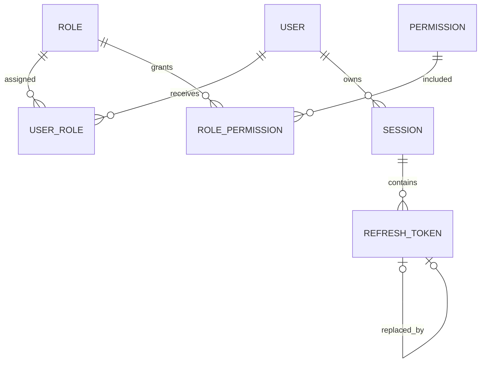

# Database

## Technology

- PostgreSQL 17
- Prisma 7
- `@prisma/adapter-pg`
- Prisma Migrate
- Prisma Client exported through `@erp/database`

The datasource URL is supplied through `prisma.config.ts` and environment configuration.

## Package lifecycle

```bash
pnpm db:generate
pnpm db:migrate
pnpm db:deploy
pnpm db:seed
pnpm db:studio
```

The `@erp/database` build runs Prisma generation before TypeScript compilation so generated runtime code and declarations exist in clean environments.

## Current model



### User

Stores identity, password hash, lifecycle timestamps, active status and soft-deletion state. Roles are assigned through `UserRole`.

### Role and Permission

Roles and permissions use unique names. `RolePermission` represents explicit many-to-many grants. `isSystem` identifies roles managed by the application seed.

### Session

Represents server-side access state. It records the owner, expiration, revocation, last usage and optional user-agent/IP metadata.

### RefreshToken

Stores only a unique token hash. `usedAt`, `revokedAt` and `replacedByTokenId` support one-time rotation and replacement-chain tracking.

## Indexing and constraints

The schema includes:

- unique user email;
- unique role and permission names;
- composite IDs for RBAC join tables;
- unique refresh-token hashes and replacement links;
- indexes for active/deleted users;
- indexes for session ownership, revocation and expiration;
- indexes for refresh-token session, revocation, expiration and creation.

Foreign keys use cascading deletion for ownership and join records. Refresh-token replacement links use `SetNull` to avoid invalid chains when a replacement is removed.

## Seed behavior

The development seed is expected to be idempotent and creates/updates:

- system roles;
- permission definitions;
- role-permission assignments;
- the administrator from `SEED_ADMIN_*` variables;
- administrator role assignment through `UserRole`.

Never use development seed credentials in a deployed environment.

## Migration policy

1. Change `schema.prisma`.
2. Create a named development migration.
3. Inspect generated SQL.
4. Update seed, projections and API contracts as needed.
5. Run generation and the full quality gate.
6. Commit schema and migration together.

Do not rewrite migrations already applied to shared environments. Use `pnpm db:deploy` outside local development.

## Pending database decisions

Before business modules are added, define:

- organization/tenant ownership;
- branch or warehouse boundaries;
- audit event storage;
- money and currency conventions;
- document numbering and concurrency rules;
- archival and retention policies;
- backup, restore and disaster-recovery procedures.
