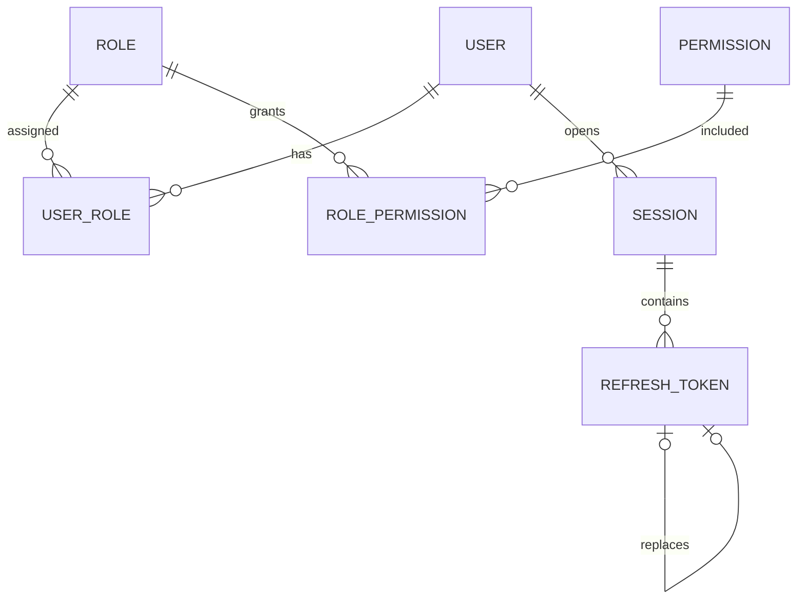

# Database

[← Security](SECURITY.md) · [API →](API.md)

## Stack

- PostgreSQL 17
- Prisma 7
- `@prisma/adapter-pg`
- Prisma Client generated into `packages/database/src/generated/prisma`

## Ownership

`@erp/database` owns:

- `prisma/schema.prisma`
- migrations
- generated client
- seed
- database exports

Applications consume the package rather than owning separate Prisma schemas.

## Entity model


```mermaid
erDiagram
    USER ||--o{ USER_ROLE : has
    ROLE ||--o{ USER_ROLE : assigned
    ROLE ||--o{ ROLE_PERMISSION : grants
    PERMISSION ||--o{ ROLE_PERMISSION : included
    USER ||--o{ SESSION : opens
    SESSION ||--o{ REFRESH_TOKEN : contains
    REFRESH_TOKEN o|--o| REFRESH_TOKEN : replaces
```

## Models

### User

Identity, credentials, profile, active state and soft-deletion timestamp.

### Role and Permission

Named authorization concepts. `isSystem` distinguishes seeded system roles.

### UserRole

Composite-key junction enabling multiple roles per user.

### RolePermission

Composite-key junction mapping permissions to roles.

### Session

Persistent login boundary with expiration, revocation and client metadata.

### RefreshToken

Hashed one-time token record with expiry, usage, revocation and replacement-chain linkage.

## Migrations

Development:

```bash
pnpm db:migrate
```

Deployment:

```bash
pnpm db:deploy
```

Do not edit committed migration SQL after it has been applied to shared environments. Add a new migration instead.

## Seed

```bash
pnpm db:seed
```

The seed is idempotent and upserts:

- all permission definitions;
- `ADMIN`, `MANAGER`, `EMPLOYEE`;
- role-permission mappings;
- the development administrator;
- the administrator's `ADMIN` role assignment.

The seed depends on `SEED_ADMIN_*` values. These variables are used by the seed script but are not part of backend runtime validation.

## Operational cautions

- Never use example credentials in production.
- Back up the database before destructive migrations.
- Run `db:deploy`, not `db:migrate`, in deployment environments.
- Treat generated Prisma code as build output.
- Review historical migrations before resetting a non-local database.
