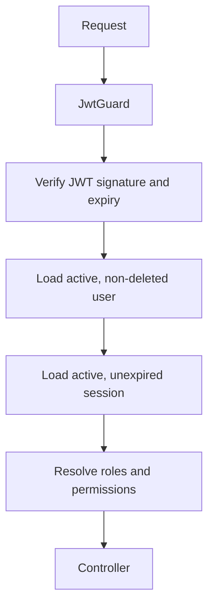

# Security

## Security model

The API is protected by default. Routes are public only when explicitly marked with `@Public()`. Authenticated routes may additionally require roles or permissions.



## Credentials

Passwords are hashed with bcrypt before persistence. Authentication returns a generic invalid-credentials failure to reduce account enumeration. Password hashes never appear in response DTOs.

Pending controls include stronger configurable password policy, throttling, compromised-password checks and account recovery.

## Access tokens and sessions

Access tokens are short-lived JWTs containing the user and session identifiers. A valid signature is insufficient by itself: every protected request validates current user and session state from the database.

This enables immediate invalidation after logout, account deactivation, user soft deletion, session expiration or server-side revocation.

## Refresh tokens

Refresh tokens are cryptographically random opaque values. Only hashes are stored.

- Tokens are single-use.
- Successful refresh creates a replacement and marks the previous token used.
- Replacement relationships are recorded.
- Unknown, used, revoked or expired tokens are rejected.
- Clients must atomically replace their stored refresh token after refresh.

Transport strategy for browser clients must be finalized before production. An HTTP-only secure cookie generally requires an explicit CSRF decision; client storage has different XSS trade-offs.

## RBAC

Users may have multiple roles through `UserRole`. Roles receive explicit permissions through `RolePermission`. The JWT strategy resolves current database-backed roles and deduplicated permissions for the request.

Controllers declare requirements using `@Roles()` and `@Permissions()`. Multiple permissions currently use AND semantics.

## Encryption

`EncryptionService` uses AES-256-GCM with a random IV and authentication tag. `ENCRYPTION_KEY` must contain exactly 64 hexadecimal characters.

Use reversible encryption only for data that must later be decrypted. Passwords and refresh tokens must be hashed instead.

## HTTP hardening

- Helmet is enabled globally.
- CORS uses the configured frontend origin and credentials policy.
- DTO validation strips and rejects unknown fields.
- Request IDs support log correlation.
- Persistence implementation details are hidden by exception filters.
- Swagger documents the bearer access-token scheme.

## Secrets

Never commit operational secrets. Generate independent values:

```bash
openssl rand -hex 64
openssl rand -hex 64
openssl rand -hex 32
```

Use a secret manager for deployed environments, rotate exposed values and keep development credentials isolated.

## Remaining production controls

- rate limiting and brute-force protection;
- password reset and email verification;
- 2FA;
- security event and administrative audit logs;
- logout-all and user-visible session management;
- automated auth/RBAC tests;
- dependency, source and container scanning;
- final browser token transport and CSRF policy;
- final-administrator protection;
- structured production observability;
- backup, restore and incident-response procedures.
