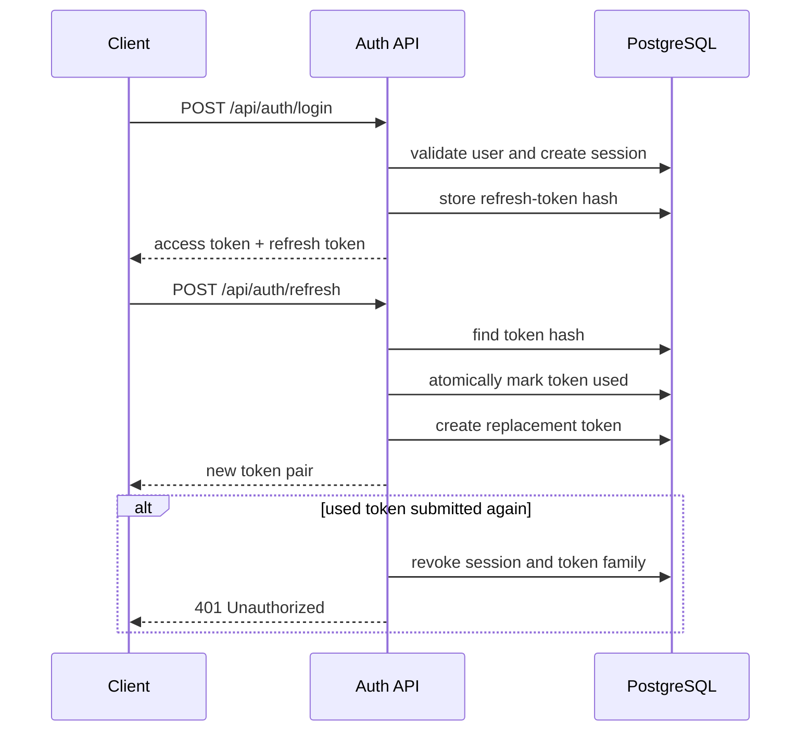

# Security

[← Backend](BACKEND.md) · [Database →](DATABASE.md)

## Security model

The backend combines short-lived JWT access tokens with persistent database sessions and one-time refresh tokens.

```mermaid
sequenceDiagram
    participant C as Client
    participant API as Auth API
    participant DB as PostgreSQL

    C->>API: POST /api/auth/login
    API->>DB: validate user and create session
    API->>DB: store refresh-token hash
    API-->>C: access token + refresh token

    C->>API: POST /api/auth/refresh
    API->>DB: find token hash
    API->>DB: atomically mark token used
    API->>DB: create replacement token
    API-->>C: new token pair

    alt used token submitted again
      API->>DB: revoke session and token family
      API-->>C: 401 Unauthorized
    end
```

## Authentication

Globally registered `JwtAuthGuard` protects routes unless `@Public()` is present.

Public endpoints:

- `GET /api/health`
- `POST /api/auth/login`
- `POST /api/auth/refresh`

## Sessions

A session belongs to a user and records:

- lifecycle timestamps;
- expiration;
- revocation;
- last usage;
- optional IP address and user agent;
- refresh tokens.

Logout revokes the current session and its refresh tokens.

## Refresh-token rotation

Refresh tokens are stored as hashes, not plaintext.

Rotation is executed inside a Prisma transaction. A valid unused token is consumed once, linked to a replacement token and updates session activity. If reuse or a concurrent double-consumption is detected, the entire token family/session is revoked.

## Roles and permissions

Roles:

| Role | Permissions |
|---|---|
| `ADMIN` | `user:create`, `user:read`, `user:update`, `user:delete` |
| `MANAGER` | `user:create`, `user:read`, `user:update` |
| `EMPLOYEE` | `user:read` |

A user may hold multiple roles through `UserRole`.

Authorization metadata:

- `@Roles(...)`
- `@Permissions(...)`

Current user-administration endpoints use permission checks.

## Passwords and cryptography

- Passwords are hashed with bcrypt.
- The seed hashes the administrator password with cost factor 12.
- `ENCRYPTION_KEY` must contain exactly 64 hexadecimal characters for AES-256-GCM utilities.
- JWT access and refresh secrets must each be at least 64 characters.

## Web security

- Helmet is enabled.
- CORS is restricted to `FRONTEND_URL`.
- DTO whitelisting and unknown-property rejection are enabled.
- Swagger bearer authentication is configured.

## Known gaps

The current repository does not yet include:

- rate limiting;
- brute-force lockout;
- multi-factor authentication;
- audit logging;
- CSRF-specific controls for cookie-based authentication;
- automated security scanning;
- documented secret rotation;
- tenant isolation.

These must be addressed before a production launch.
